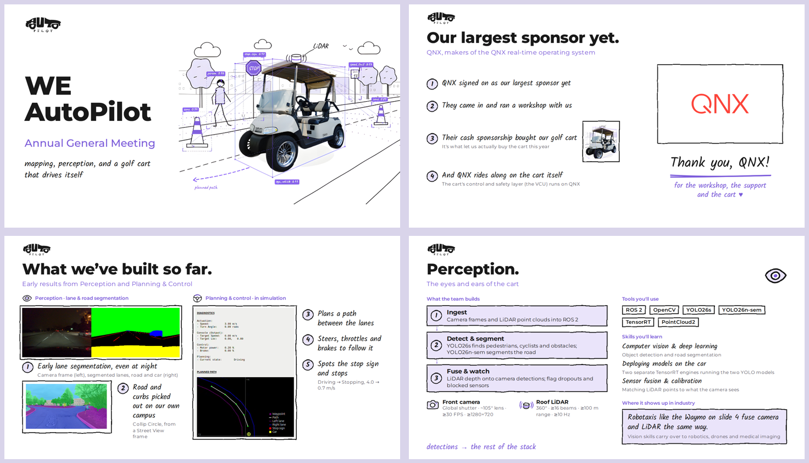

# WE AutoPilot Slides

The club's slide decks, built with [Slidev](https://sli.dev). You write slides in a Markdown file, and Slidev turns them into a presentation that runs in the browser and exports to PDF.

Every deck in this repo uses the club's **"Sketchbook"** template. It looks like a whiteboard after a good design meeting: wobbly pen outlines, lavender marker fills, handwritten notes, and photos stuck on with drawn frames. It's the template used for the 2026/27 AGM.



## Contents

1. [What's in this repo](#whats-in-this-repo)
2. [Setup](#setup)
3. [Everyday commands](#everyday-commands)
4. [Making a new deck from the AGM template](#making-a-new-deck-from-the-agm-template)
   - [Option A: copy the whole AGM deck](#option-a-copy-the-whole-agm-deck) (next year's AGM, recruitment talks)
   - [Option B: start from the starter deck](#option-b-start-from-the-starter-deck) (workshops, project updates)
   - [Option C: copy individual AGM slides](#option-c-copy-individual-agm-slides-into-any-deck)
   - [Option D: use the template in a different repo](#option-d-use-the-template-in-a-different-repo)
5. [The AGM deck, slide by slide](#the-agm-deck-slide-by-slide)
6. [Slidev basics](#slidev-basics)
7. [The Sketchbook style guide](#the-sketchbook-style-guide)
8. [Layout reference](#layout-reference)
9. [Component reference](#component-reference)
10. [Images, video and QR codes](#images-video-and-qr-codes)
11. [Presenting, exporting and hosting](#presenting-exporting-and-hosting)
12. [How the template works](#how-the-template-works)
13. [Troubleshooting](#troubleshooting)
14. [Contributing](#contributing)
15. [Credits](#credits)

## What's in this repo

| Path | What it is |
| --- | --- |
| `agm2026.md` | The 2026/27 AGM deck (19 slides). The best real example of the template. |
| `slides.md` | A short starter deck with one example of every layout, using placeholder text. |
| `layouts/` | The slide layouts: `cover`, `default`, `two-cols`, `section`, `highlights`, `flow`, `cards`, `team`. |
| `components/` | The building blocks: `SketchBox`, `SketchFrame`, `Note`, `Num`, `SketchArrow`, `Bracket`, `Doodle`, `CartDiagram`. |
| `styles/index.css` | The six colours, the fonts and all shared styles. |
| `global-top.vue` | The two SVG filters that make outlines look hand-drawn. |
| `setup/shiki.ts` | The light code-highlighting theme. |
| `public/` | Images, logo, QR codes, sponsor logos and videos used by the decks. |
| `netlify.toml`, `vercel.json` | Ready-made settings for hosting a deck as a website. |
| `docs/` | Images used in this README. |

Any `.md` deck in the repo root gets the layouts, components and styles automatically. Nothing needs to be imported or copied.

## Setup

### Requirements

- **[Node.js](https://nodejs.org) 22.12 or newer.** Check with `node --version`. Install the "LTS" version from nodejs.org if yours is older.
- **npm**, which comes with Node.js.
- **Git**, plus a code editor. [VS Code](https://code.visualstudio.com) with the official [Slidev extension](https://marketplace.visualstudio.com/items?itemName=antfu.slidev) is recommended: it shows a slide outline and a live preview.

> **Use npm, not pnpm or yarn.** The repo is set up for npm: dependency versions are pinned in `package-lock.json`. Slidev's own docs and project generator use pnpm, which is why you'll see it in tutorials, but don't use it here.

### First run

```bash
git clone <this repo's URL>
cd <repo folder>
npm install          # one time; downloads Slidev into node_modules/
npm run dev          # opens the AGM deck at http://localhost:3030
```

Edit `agm2026.md`, save, and the browser updates straight away.

## Everyday commands

| I want to… | Command |
| --- | --- |
| Open the AGM deck | `npm run dev` |
| Open the starter deck | `npm run template` |
| Open any deck | `npx slidev my-deck.md --open` |
| Export the AGM deck to PDF | `npm run export` |
| Export any deck to PDF | `npx slidev export my-deck.md` |
| Export every slide as a PNG | `npx slidev export my-deck.md --format png` |
| Build a deck as a static website | `npx slidev build my-deck.md` (output goes to `dist/`) |

The first export asks for `playwright-chromium`, a headless browser that Slidev uses to take the PDF. Install it once with `npm i -D playwright-chromium` (about 150 MB).

## Making a new deck from the AGM template

Pick the option that matches what you're making. All four keep the same look as the AGM, because the look lives in `layouts/`, `components/` and `styles/`, not in the deck file.

### Option A: copy the whole AGM deck

Best for **next year's AGM**, a recruitment or info-session talk, or a sponsor pitch, where most of the AGM's slides still make sense.

1. **Make a branch** so `main` stays clean:
   ```bash
   git checkout -b agm2027
   ```
2. **Copy the deck:**
   ```bash
   cp agm2026.md agm2027.md
   ```
3. **Update the headmatter** (the settings block at the very top). Change `title:` and `info:`. Leave `colorSchema`, `fonts` and `transition` as they are.
4. **Point the npm scripts at the new file.** In `package.json`, change `agm2026.md` to `agm2027.md` in the `dev`, `build` and `export` scripts. `build` is what Netlify/Vercel publish.
5. **Run it:** `npm run dev`.
6. **Go through it slide by slide** using [the AGM deck, slide by slide](#the-agm-deck-slide-by-slide) below. It lists what each slide is and what you'll need to replace.
7. **Delete what you don't need.** Each slide is a self-contained block between `---` lines, so delete the whole block. Add slides by copying an existing block and changing it.
8. **Check every slide** in fullscreen (`F11`, or `Ctrl+Cmd+F` on a Mac) for anything cramped, cut off or out of date. Then export a PDF (`npm run export`) and look through it.
9. **Commit and open a pull request** into `main`.

### Option B: start from the starter deck

Best for **workshops, project updates and team meetings**, where you want the look but none of the AGM content.

1. Copy the starter deck:
   ```bash
   cp slides.md workshop-ros2.md
   ```
2. Open it: `npx slidev workshop-ros2.md --open`
3. The starter has eight slides: a title slide, a free-form slide, two columns with code and a table, a section break, a photo collage, a process flow, a card grid and a team slide. Keep the ones you need and delete the rest. Copy a block to get more of the same kind.
4. Replace the placeholder text, and add your images to `public/` (see [Images, video and QR codes](#images-video-and-qr-codes)).

### Option C: copy individual AGM slides into any deck

Every slide is the text between two `---` lines, **including its frontmatter**: the `layout:` line and any settings under it. To reuse one AGM slide, for example the QNX sponsor slide or a team slide, copy that whole block into your deck and change the text and images.

```md
---
layout: team          ← copy from here…
icon: eye
steps:
  - …
---

# Perception.

## The eyes and ears of the cart
                      ← …to just before the next ---
```

### Option D: use the template in a different repo

If your team wants its slides somewhere else:

- **Easiest:** a repo admin can tick **Settings → General → Template repository** on GitHub. Anyone can then press **Use this template** to get a fresh copy of this repo, delete the decks they don't need, and start their own.
- **Into an existing Slidev project:** copy these into the project root, then copy the headmatter from `slides.md` into your deck:
  ```text
  layouts/  components/  styles/  global-top.vue  setup/  public/logo.svg
  ```
  Check that the project's Slidev version is the same or newer (`@slidev/cli` 53 here).

## The AGM deck, slide by slide

The 2026/27 deck (`agm2026.md`), with what you'd change when reusing each slide. **Bold** layouts are custom Sketchbook layouts; the rest use `default`.

| # | Slide | Layout | What to update when reusing it |
| --- | --- | --- | --- |
| 1 | WE AutoPilot: Annual General Meeting | **cover** | The `## subtitle` and handwritten tagline. The sketch is `public/photos/golf_cart_sketch-hd.jpg`. |
| 2 | The founders | default | Three `SketchFrame` headshots in `public/photos/leads/`, with names, roles and team doodles. |
| 3 | Our club | default | Mission, values and vision (rarely changes). |
| 4 | Level 4 autonomy | default | The L0–L5 boxes, the current-year target, and the Waymo photo with drawn detection boxes. |
| 5 | 2024/25 highlights | **highlights** | Five photos and matching notes. |
| 6 | 2025/26 highlights | **highlights** | Four photos and matching notes. For a new year, copy this block and change the year, photos and notes. |
| 7 | Our largest sponsor yet | default | The sponsor's logo (`public/sponsors/`), the four numbered points and the thank-you note. |
| 8 | What we've built so far | default | Perception result images and the looping planning video (`public/videos/`). |
| 9 | The road to Level 4 | **flow** | One box per year. Move `mark: true` and the "you are here" arrow to the current year. |
| 10 | A self-driving golf cart | default | The three stat boxes and the `CartDiagram` sketch. |
| 11 | How WEAP is built | **section** | Section break. |
| 12 | WEAP components | **flow** | The autonomy pipeline, with brackets for which team owns which step. |
| 13 | Technical team | **cards** | One card per team, with each lead's headshot, name and role under `people:`. |
| 14–16 | Perception / Mapping & localization / Planning & control | **team** | Each team's steps, key hardware, tools, skills and industry note. Update the tools every year. |
| 17 | What every team feeds into | **cards** | The shared systems, with the operating states in the side column. |
| 18 | Business team | **cards** | Finance and Communications & Marketing cards, with leads. |
| 19 | Join the ride | **cards** | Socials, and the Discord QR in `public/qr/discord.png`. |

**Common reuse jobs:**

- **New executives or leads:** add their photo to `public/photos/leads/`, update `src`, `name` and `role` in the `people:` lists (slides 13 and 18) and in the founders' `SketchFrame`s (slide 2). If a face is cut off, adjust `pos:` (for example `pos: center 25%`).
- **A new year of highlights:** copy slide 6's block and change the title, `photos:`, `notes:` and the `next:` teaser.
- **A new sponsor:** put their logo in `public/sponsors/` (SVG if possible), then copy slide 7 and update the points. Keep the logo in its real brand colours.
- **A new results video:** see [Looping videos](#looping-videos) for how to trim and crop it.

## Slidev basics

### A deck is one Markdown file

```md
---
title: My talk                 # the first block is the "headmatter":
colorSchema: light             # settings for the whole deck
fonts:
  sans: Montserrat
  provider: none
transition: fade
layout: cover                  # …and the first slide's layout
---

# First slide.

---

# Second slide.

## A purple subtitle

Some text, then **bold**, then a list:

- Lists render as handwritten notes
- <small>Put a caption under one with small</small>

<!-- Speaker notes: an HTML comment at the very end of a slide. -->

---
layout: section                # a block right after --- sets this slide's options
doodle: wrench
---

# A section break.
```

- **`---` on its own line starts a new slide.** A YAML block right after it holds that slide's options ("frontmatter"), and `layout:` picks the layout.
- **Copy the headmatter from `slides.md`** when you start a deck. It sets the light colour scheme, the fonts and the fade transition.
- **Titles and subtitles:** `# Title.` is the slide title and `## …` the subtitle under it.
- **Markdown and HTML mix freely.** Utility classes such as `flex`, `grid`, `grid-cols-2`, `gap-4`, `mt-3` and `text-center` work on any element (Slidev uses [UnoCSS](https://unocss.dev), which is Tailwind-compatible).

### Clicks and emphasis

- `<v-click>…</v-click>` reveals something on the next click, and `<v-clicks>` reveals a list item by item ([docs](https://sli.dev/guide/animations)).
- `v-mark` draws a purple underline, circle or highlight on a click. Use it for the one key phrase on a slide:
  ```html
  <span v-mark="{ at: 1, type: 'underline', color: '#7C5CDB', strokeWidth: 3 }">key phrase</span>
  ```
  `type` can be `underline`, `circle`, `highlight` or `box`, and `at` is the click number.

### Keyboard shortcuts while presenting

| Key | Action |
| --- | --- |
| `→` or `Space` | Next click or slide |
| `←` | Back |
| `O` | Overview of all slides (click one to jump to it) |
| `Esc` | Close the overview |

**Presenter mode** (speaker notes, the next slide and a timer) isn't a key: open `http://localhost:3030/presenter/`, or use the toolbar that appears when you hover over the bottom-left corner of a slide. For **fullscreen**, use the browser's own fullscreen (`F11`, or `Ctrl+Cmd+F` on a Mac) or the toolbar.
| `G` | Go to a slide number |

Full Slidev documentation: <https://sli.dev/guide/>.

## The Sketchbook style guide

### Colours

Use only these six. They're CSS variables in `styles/index.css`, so in custom HTML write `color: var(--purple)` rather than a hex code.

| Token | Hex | Use for |
| --- | --- | --- |
| `--paper` | `#FFFFFF` | Background |
| `--ink` | `#191919` | Text and all pen outlines |
| `--purple` | `#7C5CDB` | Annotations, arrows, marks, small labels, subtitles |
| `--lavender` | `#EAE4FA` | The only fill colour (the "marker") |
| `--lilac` | `#BEAEED` | Secondary lines, quiet dividers |
| `--muted` | `#5D5A66` | Small captions under notes |

Photos, videos and sponsor logos keep their real colours. Code blocks sit on a pale `#F7F5FD` with a thin lilac border.

### Fonts

- **Montserrat:** titles, body text, and anything people must read exactly, such as names, numbers and specs.
- **Kalam:** handwriting, for notes, asides, explanations and arrow labels. Add `class="hand"` to any element, plus `purple` for an annotation (`class="hand purple"`).
- **Monospace:** only inside code blocks.

Both fonts load from Google Fonts, so **the presenting laptop needs internet**. Without it they fall back to system fonts.

### Rules of thumb

- **4–6 things to talk about per content slide.** Only `section` slides should be sparse. If a slide has one or two things on it, merge it with a neighbour.
- **Titles** are sentence case and end with a full stop: `# Our club.`
- **Only outlines and arrows wobble.** Text, photos and code always stay crisp.
- **Numbers** (`Num`, numbered notes, photo badges) are for real sequences, or to match a photo to its note. Don't use them as decoration.
- **Photos** get a `SketchFrame`, never rounded corners, shadows or filters, and always `alt` text.
- **Avoid:** dark backgrounds, gradients, glows, emoji icons, ALL-CAPS spaced-out labels and outlined text.
- **Text size:** body text 13–16 px, handwriting 16–20 px, captions no smaller than about 10.5 px.

## Layout reference

Every layout except `cover` puts the logo top-left, with the `# title` and `## subtitle` under it. **`slides.md` has a working example of each one.**

### `cover`: title slide

```md
---
layout: cover
image: /photos/golf_cart_sketch-hd.jpg   # the picture on the right
imageAlt: Describe the image
---

# WE<br>AutoPilot

## Annual General Meeting

<p class="hand">mapping, perception, and a golf cart that drives itself</p>
```

### `default`: free layout

This is used when a slide has no `layout:`. You get the logo, title and subtitle, then any Markdown or HTML. Most custom AGM slides (founders, sponsor, results) are `default` slides built with a `grid` and the components below.

### `two-cols`: two columns

Content before `::right::` goes in the left column, and content after it in the right.

### `section`: section break

```md
---
layout: section
doodle: wrench        # any Doodle name
---

# Section title.

One handwritten line.
```

### `highlights`: photo collage

One big photo plus smaller ones (3–5 in total), each with a numbered badge. Matching numbered notes sit on the right, and an optional "next up" strip runs along the bottom.

```yaml
layout: highlights
photos:
  - { src: /photos/a.jpg, alt: What's in it, pos: center 30% }   # the first one is the big one
  - { src: /photos/b.jpg, alt: … }
notes:
  - Note for photo 1
  - { text: Note for photo 2, caption: small print }
next: "next up: … →"        # optional
```

`pos` moves the crop (CSS `object-position`, for example `center 30%` or `left center`). Use it to keep faces in frame.

### `flow`: process or pipeline

3–6 boxes joined by arrows. Each box has a plain-language label, the technical term under it, and a handwritten note below.

```yaml
layout: flow
image: /photos/golf-cart.png        # optional picture on the far left
imageNote: the vehicle              # optional
steps:
  - { label: Sense, term: Sensors, note: raw data }
  - { label: Perceive, term: Perception, note: …, mark: true }        # circled on click
  - { label: Later, term: Next, note: …, fill: none, dashed: true }   # a future step
loop: and round again               # optional loop arrow back to step 1
brackets:                           # optional; steps are numbered from 1
  - { from: 2, to: 2, label: Perception team }
rowTop: 186                         # optional: move the row down (px)
```

Content after `::extra::` is drawn on top of the slide. The roadmap slide uses it for its "you are here" arrow.

### `cards`: teams, options, comparisons

```yaml
layout: cards
cols: 2            # columns (default 2)
face: 64           # headshot size in px
textSize: 16.5     # handwriting size in px
sideWidth: 230     # width of the ::side:: column
cards:
  - icon: eye                       # a Doodle name
    name: Perception
    text: The handwritten description.
    tools: A small purple line, e.g. tools
    people:
      - { src: /photos/leads/x.jpg, name: Full Name, role: Their role, pos: center 30% }
```

Content after `::side::` goes in a column on the right, such as numbered notes, the operating-state boxes, or a QR code with "← scan me!".

### `team`: one technical team up close

```yaml
layout: team
icon: eye
steps:                      # what the team builds (3 is the sweet spot)
  - { label: Ingest, text: Camera frames and LiDAR into ROS 2 }
facts:                      # 2 key facts, each with a Doodle icon
  - { icon: camera, label: Front camera, caption: small print }
tools: [ROS 2, OpenCV, TensorRT]
skills:
  - Computer vision
  - { text: Sensor fusion, caption: small print }
industry: { text: Where it shows up in industry., caption: small print }
handoff: "detections → the rest of the stack"
```

## Component reference

You can use these in any slide. Sizes are px on Slidev's 980 × 552 canvas; it scales to the screen automatically.

### `SketchBox`

A lavender box with a wobbly pen border. Use it for steps, callouts and stats.

```html
<SketchBox :pad="'12px 16px'">…</SketchBox>
<SketchBox fill="none" dashed>…</SketchBox>       <!-- white, dashed: e.g. a future step -->
```

### `SketchFrame`

A photo with a drawn frame about 6 px outside it. Give it a size with `style`.

```html
<SketchFrame src="/photos/team.jpg" alt="The team at the AGM" style="width: 240px; height: 160px" />
<SketchFrame src="/photos/team.jpg" alt="…" pos="center 25%" :n="1" corner="tr" style="…" />
<SketchFrame src="/sponsors/logo.svg" alt="…" fit="contain" style="…" />   <!-- show the whole image -->
```

| Prop | Default | Meaning |
| --- | --- | --- |
| `src`, `alt` | | Image path and description |
| `pos` | `center` | Crop position (`object-position`) |
| `fit` | `cover` | `contain` shows the whole image (logos, QR codes) |
| `n`, `corner` | | Numbered badge (`tl`, `tr`, `bl` or `br`) |

You can also put your own media in its default slot, such as a `<video>` (see [Looping videos](#looping-videos)).

### `Note` and `Num`

```html
<Note :n="1" caption="Small grey caption">A handwritten line</Note>
<Note color="purple">An annotation</Note>
<Num :n="2" />                  <!-- just the hand-drawn numbered circle -->
```

### `SketchArrow`

A curved pen arrow from (x1, y1) to (x2, y2), in px relative to the nearest parent with `class="relative"`. `bend` curves it (negative bends the other way), and `color="ink"` makes it black.

```html
<div class="relative" style="width: 200px; height: 80px">
  <span class="hand purple absolute" style="left: 40px; top: 0">look here</span>
  <SketchArrow :x1="60" :y1="30" :x2="0" :y2="70" :bend="12" />
</div>
```

Use Slidev's built-in `<Arrow>` for plain straight arrows.

### `Bracket`

A hand-drawn bracket with a purple handwritten label, for "who owns what":

```html
<Bracket label="Perception team" style="width: 200px" />
```

### `Doodle`

Pen-drawn icons: `<Doodle name="lidar" :size="32" />`

`eye` · `map-pin` · `steering-wheel` · `wrench` · `lidar` · `cone` · `camera` · `browser` · `coins` · `megaphone` · `calendar` · `briefcase` · `chat` · `shield` · `log` · `path` · `alert`

To add a new icon, copy one of the `<template v-else-if="name === '…'">` blocks in `components/Doodle.vue`. Icons are drawn on a 24 × 24 grid with an ink outline, a little purple, and a white or lavender fill.

### `CartDiagram`

A top-down sketch of the golf cart with LiDAR rings, the camera's view, detections and the planned path. It's used on the AGM's golf cart slide: `<CartDiagram />`.

## Images, video and QR codes

### Images

- **Where they go:** put files in `public/` and reference them with a leading slash, so `public/photos/team.jpg` becomes `/photos/team.jpg`. Folders in use: `photos/` (with `photos/leads/` for headshots), `qr/`, `sponsors/` and `videos/`.
- **Formats:** JPG for photos, SVG for logos, PNG for screenshots.
- **Size:** keep each file under about 1–1.5 MB, since everyone who clones the repo downloads every file. Around 1600 px on the long side is plenty for a projector.
- **Blurry photos:** a small headshot (under ~400 px) will look blurry when shown large. Ask for a bigger original, or upscale it with an AI upscaler; the AGM headshots ending in `-hd.jpg` were upscaled with Real-ESRGAN.

### Looping videos

Videos should be short, silent and trimmed to the interesting part. With [ffmpeg](https://ffmpeg.org/download.html) installed:

```bash
# Keep seconds 13–40, drop the audio, crop to a 500×650 region whose top-left corner
# is at x=484, y=150, and scale it down for the web:
ffmpeg -ss 13 -to 40 -i raw.mp4 -an \
  -vf "crop=500:650:484:150,scale=750:-2" \
  -c:v libx264 -crf 20 -pix_fmt yuv420p -movflags +faststart public/videos/clip.mp4

# A still frame to show in PDF/PNG exports, where video can't play:
ffmpeg -ss 2 -i public/videos/clip.mp4 -frames:v 1 public/videos/clip_poster.png
```

Then put it on a slide:

```html
<SketchFrame style="width: 246px; height: 320px">
  <video class="sk-frame-media" src="/videos/clip.mp4" poster="/videos/clip_poster.png"
         autoplay loop muted playsinline aria-label="What the video shows" />
</SketchFrame>
```

`muted` is required, because browsers won't autoplay a video with sound. Keep raw recordings out of the repo; commit only the trimmed clip.

### QR codes

Put them in a `SketchFrame` with `fit="contain"`, at least about 200 px on the slide, and scan-test them from the back of the room. The Discord QR is `public/qr/discord.png`.

## Presenting, exporting and hosting

### Presenting

1. Open the deck (`npm run dev`) on the laptop that's plugged into the projector.
2. Open presenter mode on your laptop screen at `http://localhost:3030/presenter/`. Open the normal view (`http://localhost:3030`) in a second window, drag it onto the projector screen and make it fullscreen (`F11`, or `Ctrl+Cmd+F` on a Mac). The two windows stay in sync.
3. **Check the internet connection** (the fonts come from Google Fonts), and click through every slide once beforehand so videos and images are loaded.

### Exporting

- **PDF:** `npx slidev export my-deck.md` writes `my-deck-export.pdf`.
- **PNG of each slide:** `npx slidev export my-deck.md --format png`
- **Missing browser:** if export complains, run `npm i -D playwright-chromium` once.
- **What doesn't export:** videos show their `poster` image, and click animations appear in their final state.
- **Sharing:** exports are git-ignored. Share PDFs through the club Drive or Discord.

### Hosting a deck as a website

`netlify.toml` and `vercel.json` are already configured. Connect the GitHub repo on [Netlify](https://www.netlify.com) or [Vercel](https://vercel.com); every push to `main` runs `npm run build` and publishes the deck in `dist/`. The `build` script decides which deck is published, so change it in `package.json` to host a different one.

## How the template works

You only need this section if you're changing the template itself.

- **Automatic pickup:** Slidev loads `layouts/*.vue`, `components/*.vue`, `styles/index.css`, `global-top.vue` and `setup/*.ts` for every deck in the folder. Layout names that match Slidev's built-in ones (`default`, `cover`, `section`, `two-cols`) replace them.
- **The wobble:** `global-top.vue` defines two SVG filters, `#rough` and `#rough-sm`. A filter would also distort any text inside the element it's applied to, so borders and fills are drawn on a `::before` pseudo-element behind the content, and only that pseudo-element is filtered:
  ```css
  .my-box { position: relative; isolation: isolate; }
  .my-box::before {
    content: ''; position: absolute; inset: 0; z-index: -1;
    border: 2px solid var(--ink); background: var(--lavender);
    filter: url(#rough);
  }
  ```
  Use `#rough-sm` on small things like icons and number circles.
- **Shared code:** every layout and component is used by every deck. After changing one, open both `agm2026.md` and `slides.md` and click through them before merging.

## Troubleshooting

| Problem | Fix |
| --- | --- |
| `pnpm install` or `pnpm run dev` fails | Use npm: `npm install`, then `npm run dev`. |
| `Unsupported engine` or Slidev won't start | Update Node.js to 22.12 or newer (`node --version`). |
| `Port 3030 is in use` | `npx slidev my-deck.md --port 3031`, or close the other Slidev window. |
| Export says Playwright is missing | `npm i -D playwright-chromium`, then export again. |
| Fonts look wrong (Arial or Comic Sans) | No internet connection. The fonts load from Google Fonts. |
| A slide shows raw HTML or a stray code block | There's a blank line inside an HTML block. Remove blank lines between `<div>` tags. |
| SVG text is enormous | Don't use `font-size="12"` on SVG `<text>`; UnoCSS turns it into a class. Use `style="font: 600 12px Montserrat"`. |
| Text looks wobbly or blurry | A wobble filter is on an element that contains text. Move the border to `::before` (see above). |
| Speaker notes show up on the slide | The notes comment must be the *last* thing on the slide. |
| Image doesn't show | The path must start with `/` and the file must be inside `public/`; `/photos/x.jpg` means `public/photos/x.jpg`. Paths are case-sensitive. |
| Video doesn't autoplay | Add `muted` and `playsinline`. Use H.264 MP4 (the ffmpeg command above). |
| Something's cut off at the bottom | The slide is too full. Trim the text or split the slide; don't shrink text below ~12 px. |

## Contributing

- **One branch per deck or change:**
  ```bash
  git checkout -b workshop-ros2
  # …work…
  git add workshop-ros2.md public/photos/workshop/
  git commit -m "Add ROS 2 workshop deck"
  git push -u origin workshop-ros2
  ```
  Then open a pull request into `main`.
- **Name decks clearly:** for example `agm2027.md`, `workshop-ros2.md`, `recruitment-fall2026.md`.
- **Group a deck's images** in a subfolder: `public/photos/workshop-ros2/`.
- **Don't commit** exported PDFs, raw screen recordings, or huge original photos.
- **Template changes** (layouts, components, styles) need a quick check of every deck, since they all share the template.

## Credits

- **Built with:** [Slidev](https://sli.dev). Fonts: [Montserrat](https://fonts.google.com/specimen/Montserrat) and [Kalam](https://fonts.google.com/specimen/Kalam), both under the SIL Open Font License.
- **QNX logo:** from [Wikimedia Commons](https://commons.wikimedia.org/wiki/File:QNX-Logo-QNX-CORAL-RGB.svg) and a trademark of BlackBerry/QNX. It's used only to credit QNX as our sponsor.
- **Waymo photo:** used to illustrate Level 4 autonomy.
- **Club material:** the WE AutoPilot logo, the photos and the golf cart sketch belong to the club and its members. Ask before reusing them outside club material.
